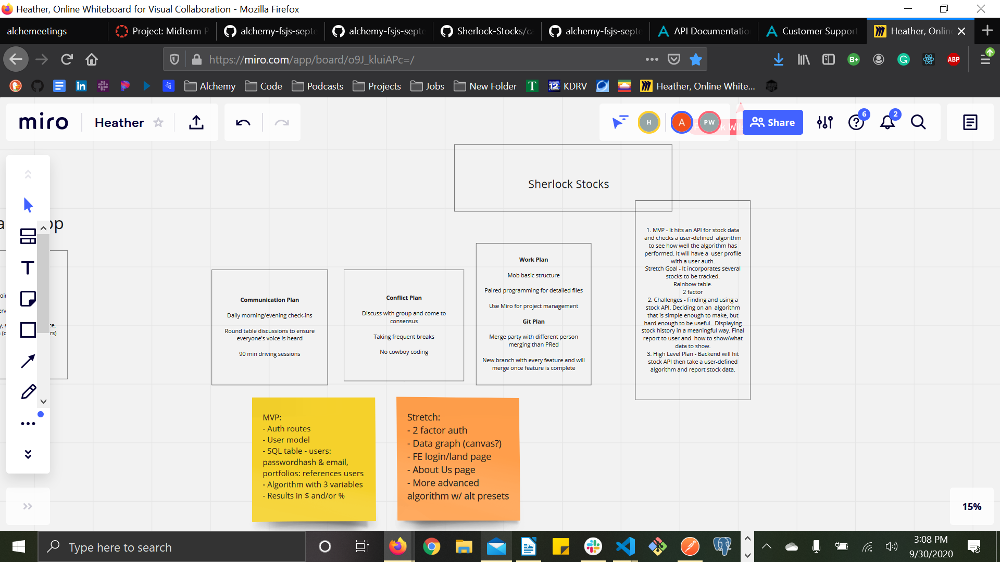

# career-track-midterm-project

---
    User Stories

        1. Title: Business professional
        As a business professional, I want to be able to make medium to long term investments for my vacation funds.
        - 30s
        - $$$
        - vacation fund
        - risk level => aggressive
        Feature - I want to make aggressive risk investments.
        Acceptance Test - User's portfolio is unique and requires auth

        2. Title: New college graduate
        As a new college graduate, I want to be able to pay off debt and save for the future.
        - 20s
        - $
        - debt payoff
        - risk level => medium
        Feature - I want to make medium risk investments.
        Acceptance Test - User's portfolio is unique and requires auth

        3. Title: Self-employed day trader
        As a self-employed day trader, I want to be able to make high risk investments for high profit returns.
        - 40s
        - $$$$
        - day trading investments
        - risk level => aggressive
        Feature - I want to make as much money as soon as possible.
        Acceptance Test - User's portfolio is unique and requires auth

        4. Title: Retiree:
        As a retiree, I want to be able to make safe investments to contribute to my retirement fund.
        - 60s
        - $$$
        - contribute to retirement funds
        - risk level => conservative
        Feature - I want to be able to put away enough money to retire in safe investments in bonds and cash.
        Acceptance Test - User's portfolio is unique and requires auth

        5. Title: Professional close to retiring
        As a professional close to retiring, I want to be able to build my portfolio to invest for retirement.
        - 50s
        - $$$$
        - invest for retirement
        - risk level => medium
        Feature - I want to be able to made medium investments to stay ahead of the market and watching for a time to change to conservative investments.
        Acceptance Test - User's portfolio is unique and requires auth

---

    Software Requirements

        Vision: To create a secure investment app that helps users navigate stock investments in a simplified manner.
        Pain Point: The app solves the problem of navigating complex stock choices.
        Equal opportunity for investing and making money.

        Scope: In: Our product will allow a secure login to safely navigate their finances and stock choices.
        The app will provide secure portfolios and testable algorithm variables that the users can choose.
        Each user will be able to observe their algorithm portfolio.
        Out: Our product will not guarantee profits or successful investments. We will not be liable for losses. It will not automatically buy or sell stocks.

        MVP: It will have authorization routes with a user model. Our SQL table will contain users with password hashes, emails, and portfolios that reference a user id. Our algorithm will have three variables and the results of gains or losses will be displayed as percentages and/or a monetary value.

        Stretch Goal: Our stretch goal will be to include two factor user authorizations. We would also like to include a data graph that displays a user's results on a front end page. The front end would also include a login/landing page. Adding more advanced algorithms and being able to connect to other markets would also be a stretch goal we would consider.

        Functional Requirements: 1. Auth route/sign in
        2. Choose algorithm variables
        3. See portfolio
        4. Update algorithm
        Data Flow: 1. A user will sign in securely.
        2. A user will be able to access their personal portfolio and see their algorithm results with gains and losses.
        3. A user can select their algorithm variables to determine their risk factor and frequency of trades.
        4. A user is able to update their algorithm based on results to optimize a computer to make the money.

        Non-Functional Requirements: Our app will have a login requirement to save user's settings. It will also include a form for user's to input their variables to ensure ease of use. A portfolio will display results in a simple and easy to read way.

---

    Wireframes - from Miro:

---

